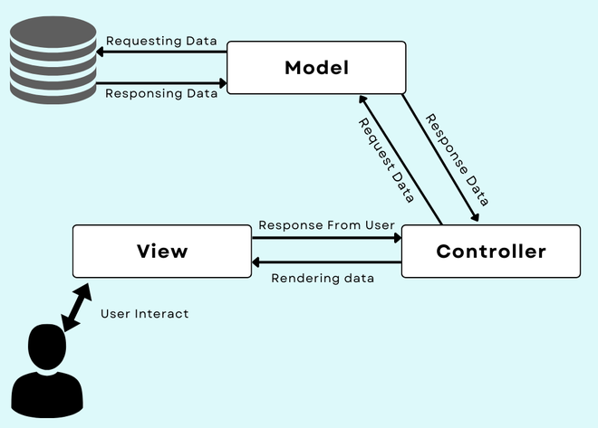

# Vinlo

Vinlo là một blog đơn giản được xây dựng bằng Laravel. Được xây dựng dựa trên Blog [Viblo](https://viblo.asia/), Vinlo đem đến cho người dùng giao diện thân thiện, dễ dàng tạo và quản lý bài viết, comment, downvote, upvote bài viết, theo dõi người dùng khác.

## Chức năng

- Xác thực người dùng
- Chỉnh sửa thông tin cá nhân
- Tạo, đọc, cập nhật và xóa bài viết
- Upvote, Downvote bài viết
- Bình luận trên bài viết
- Follow, Unfollow người dùng

## Kiến trúc sản phẩm
### 1. Mô hình MVC
- Model: Quản lý dữ liệu của ứng dụng. Tất cả các tương tác với cơ sở dữ liệu được xử lý tại đây.
- View: Chịu trách nhiệm hiển thị dữ liệu. Sử dụng các template Blade để render HTML. 
- Controller: Xử lý các yêu cầu của người dùng, xử lý đầu vào bằng cách sử dụng model, và chọn các view để phản hồi.


### 2. Cấu trúc thư mục chính
```md
|   |-- Http/
|   |   |-- Controllers/
|   |   |   |-- CommentsController.php
|   |   |   |-- FollowsController.php
|   |   |   |-- PostsController.php
|   |   |   |-- UsersController.php
|   |   |   |-- VotesController.php
|   |   |-- Middleware/
|   |-- Models/
|   |   |-- Comment.php
|   |   |-- Follow.php
|   |   |-- Post.php
|   |   |-- User.php
|   |   |-- Vote.php
|
|   |-- resources/views
|   |   |-- auth
|   |   |-- layouts
|   |   |-- partials
|   |   |-- posts
|   |   |-- users
```
### 3. Các thành phần chính
#### 1. Controller
- **UsersController**: Xử lý các chức năng người dùng.

- **PostsController**: Xử lý các hành động liên quan đến bài viết như tạo, sửa, xóa, và xem bài viết.

- **CommentsController**: Xử lý comment trong bài viết.

- **FollowsController**: Xử lý chức năng follow/unfollow giữa các người dùng.

- **VotesController**: Xử lý chức năng upvote/ downvote bài viết.
#### 2. Model 
- **User**: Model cho người dùng.

- **Follow**: Model đại diện cho mối quan hệ follow giữa các người dùng.

- **Vote**: Model đại diện cho việc upvote/ downvote bài viết.

- **Comment**: Model đại diện cho comment trong bài viết.

- **Post**: Model đại diện cho bài viết.

#### 3. View
- **auth**: Các view cho xác thực người dùng.

- **layouts**: Các view cho cấu trúc chung của blog.

- **partials**: Các view con được sử dụng trong các view khác.

- **posts**: Các view cho bài viết.

- **users**: Các view cho người dùng.
## Cài đặt

1. Sao chép repository:
   ```sh
   git clone https://github.com/lyng148/Vinlo.git
   cd Vinlo
2. Cài đặt dependency
    ```sh
   composer install
   npm install
3. Cấu hình cài đặt cơ sở dữ liệu trong tệp .env.
4. Chạy lệnh migrate
   ```sh
   php artisan migrate
5. Khởi chạy
    ```sh
   php artisan serve
   npm run dev

